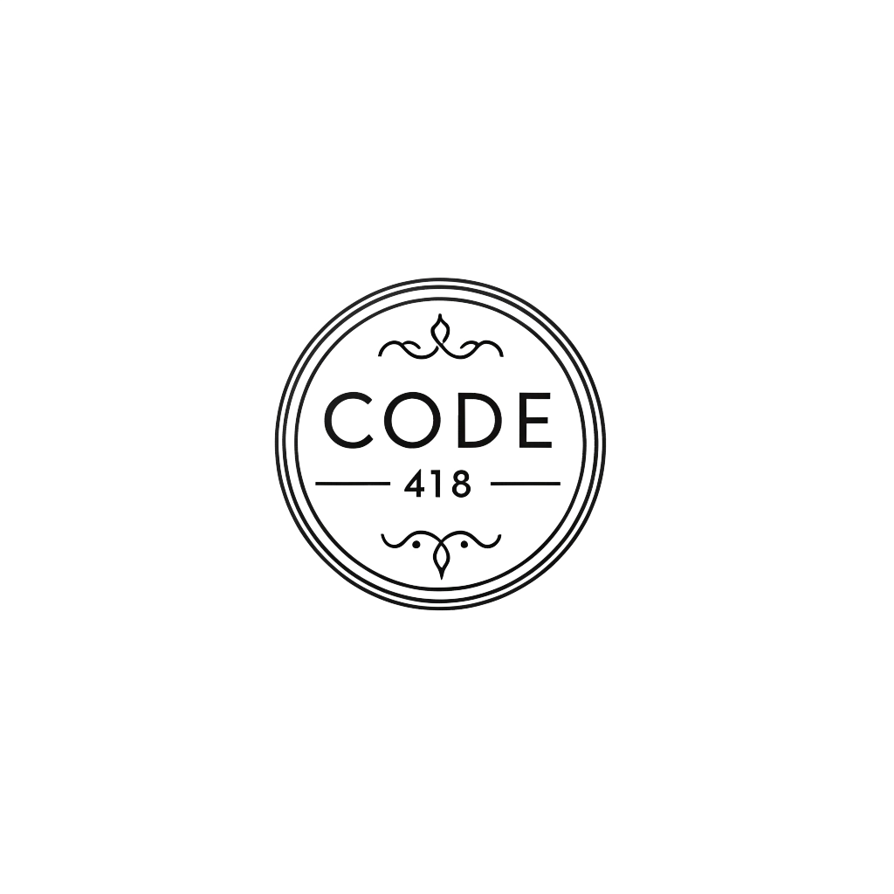

# CODE 418

## Table of Contents

- [What is CODE 418?](#what-is-code-418)
- [High-Level Architecture](#high-level-architecture)
- [Getting Started](#getting-started)
- [Deployment](#deployment)
- [Tech Stack](#tech-stack)
- [Troubleshooting](#troubleshooting)
- [Resources](#resources)
- [People](./team/)
- [Diversity](./team/diversity.md)
- [Product & Research](./product_research/)
  - [Market](./product_research/market.md)
  - [Roadmap](./product_research/roadmap.md)

## What is CODE 418?

CODE 418 is a company founded in the software development industry. We aim to build impact software that solves real-world problems and create meaningful value.

#### Team Slack/Discord Channel: #team\-code-418 (TBD)

## High-Level Architecture

TBD

[Architecture Diagram](./architecture/diagram.md)

[Architecture Decision Records](./architecture/adrs/)

## Getting Started

TBD

## Deployment

TBD

## Tech Stack

TBD

## Troubleshooting

TBD

## Resources

TBD
