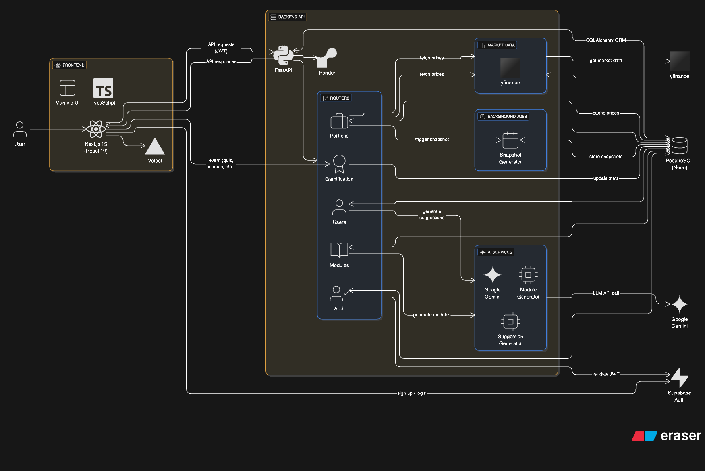

# FinQuest Architecture Diagram

## Overview

FinQuest uses a modern full-stack architecture with a React frontend, FastAPI backend, and integrated AI services. The platform separates concerns between presentation, business logic, data persistence, and external services while maintaining a cohesive user experience.

## Core Components

### Frontend Layer
**Next.js Web Application** - Hosted on Vercel
- **Technology:** Next.js 15.5.4 with React 19, TypeScript, and Mantine UI
- **Responsibilities:**
  - User interface for portfolio management, learning pathways, and gamification
  - Client-side routing and state management
  - Authentication UI (Supabase integration)
  - Real-time data visualization and charts
- **Deployment:** Vercel with automatic scaling and global CDN distribution
- **Key Files:**
  - [`app/web/pages/_app.tsx`](https://github.com/dcsil/FinQuest/blob/HEAD/app/web/pages/_app.tsx) - Application entry point
  - [`app/web/lib/api.ts`](https://github.com/dcsil/FinQuest/blob/HEAD/app/web/lib/api.ts) - API client
  - [`app/web/contexts/AuthContext.tsx`](https://github.com/dcsil/FinQuest/blob/HEAD/app/web/contexts/AuthContext.tsx) - Authentication
  - [`app/web/contexts/GamificationContext.tsx`](https://github.com/dcsil/FinQuest/blob/HEAD/app/web/contexts/GamificationContext.tsx) - Gamification state

### Backend API (FastAPI on Render)

**FastAPI Application** - Hosted on Render
- **Technology:** FastAPI with Python 3.11+, SQLAlchemy ORM
- **Responsibilities:**
  - RESTful API endpoints for all application features
  - Business logic and request validation
  - JWT token validation (Supabase)
  - Database operations via SQLAlchemy
  - Integration with AI services and market data
- **Key Files:**
  - [`app/services/api/src/finquest_api/main.py`](https://github.com/dcsil/FinQuest/blob/HEAD/app/services/api/src/finquest_api/main.py) - FastAPI app and router configuration
  - [`app/services/api/src/finquest_api/routers/`](https://github.com/dcsil/FinQuest/tree/HEAD/app/services/api/src/finquest_api/routers) - API route handlers
  - [`app/services/api/src/finquest_api/auth_utils.py`](https://github.com/dcsil/FinQuest/blob/HEAD/app/services/api/src/finquest_api/auth_utils.py) - JWT validation

**Routers:**
- **Auth Router:** [`routers/auth.py`](https://github.com/dcsil/FinQuest/blob/HEAD/app/services/api/src/finquest_api/routers/auth.py) - User authentication endpoints
- **Portfolio Router:** [`routers/portfolio.py`](https://github.com/dcsil/FinQuest/blob/HEAD/app/services/api/src/finquest_api/routers/portfolio.py) - Portfolio management and analytics
- **Modules Router:** [`routers/modules.py`](https://github.com/dcsil/FinQuest/blob/HEAD/app/services/api/src/finquest_api/routers/modules.py) - Learning module endpoints
- **Users Router:** [`routers/users.py`](https://github.com/dcsil/FinQuest/blob/HEAD/app/services/api/src/finquest_api/routers/users.py) - User profile and AI suggestions
- **Gamification Router:** [`routers/gamification.py`](https://github.com/dcsil/FinQuest/blob/HEAD/app/services/api/src/finquest_api/routers/gamification.py) - XP, levels, streaks, badges

### AI Services (Integrated in FastAPI)

**LLM Service Layer**
- **Technology:** Google Gemini 2.0 Flash via provider-agnostic interface
- **Responsibilities:**
  - Generate personalized learning modules based on user profile and portfolio
  - Analyze portfolio and user goals to create adaptive suggestions
  - Country-specific content generation
- **Key Files:**
  - [`services/llm/service.py`](https://github.com/dcsil/FinQuest/blob/HEAD/app/services/api/src/finquest_api/services/llm/service.py) - Provider-agnostic LLM interface
  - [`services/llm/providers/gemini.py`](https://github.com/dcsil/FinQuest/blob/HEAD/app/services/api/src/finquest_api/services/llm/providers/gemini.py) - Gemini API client
  - [`services/module_generator.py`](https://github.com/dcsil/FinQuest/blob/HEAD/app/services/api/src/finquest_api/services/module_generator.py) - Module generation service
  - [`services/suggestion_generator.py`](https://github.com/dcsil/FinQuest/blob/HEAD/app/services/api/src/finquest_api/services/suggestion_generator.py) - Suggestion generation service

**Integration:** AI services are called synchronously by backend routers when generating modules or suggestions. Background tasks handle async generation to avoid blocking API responses.

### Authentication Service (Supabase)

**Supabase Auth**
- **Technology:** Supabase Authentication (managed service)
- **Responsibilities:**
  - User registration and login (email/password, Google OAuth)
  - JWT token generation and validation
  - Session management
- **Integration:**
  - Frontend: [`app/web/contexts/AuthContext.tsx`](https://github.com/dcsil/FinQuest/blob/HEAD/app/web/contexts/AuthContext.tsx) - Supabase client for auth
  - Backend: [`app/services/api/src/finquest_api/auth_utils.py`](https://github.com/dcsil/FinQuest/blob/HEAD/app/services/api/src/finquest_api/auth_utils.py) - JWT validation
  - Backend: [`app/services/api/src/finquest_api/supabase_client.py`](https://github.com/dcsil/FinQuest/blob/HEAD/app/services/api/src/finquest_api/supabase_client.py) - Supabase client

**Flow:** Frontend authenticates with Supabase → receives JWT → sends JWT in API requests → Backend validates JWT → creates/retrieves user record in PostgreSQL

### Market Data Services

**yfinance Integration**
- **Technology:** yfinance Python library
- **Responsibilities:**
  - Fetch real-time and historical stock prices
  - Resolve instrument symbols and metadata
  - Fetch FX rates for currency conversion
- **Key Files:**
  - [`services/pricing.py`](https://github.com/dcsil/FinQuest/blob/HEAD/app/services/api/src/finquest_api/services/pricing.py) - Price fetching and caching
  - [`services/instruments.py`](https://github.com/dcsil/FinQuest/blob/HEAD/app/services/api/src/finquest_api/services/instruments.py) - Symbol resolution
  - [`services/fx.py`](https://github.com/dcsil/FinQuest/blob/HEAD/app/services/api/src/finquest_api/services/fx.py) - FX rate fetching

**Integration:** Services are called by portfolio service to fetch market data. Prices are cached in database (`InstrumentPriceLatest`, `InstrumentPriceEOD`) to reduce API calls.

### Data Storage

**PostgreSQL Database (Neon)**
- **Technology:** PostgreSQL (serverless) with SQLAlchemy 2.0 ORM
- **Hosting:** Neon (serverless PostgreSQL)
- **Responsibilities:**
  - Store all application data (users, portfolios, transactions, modules, progress, gamification)
  - Provide ACID guarantees for financial data
  - Support complex queries for analytics
- **Key Files:**
  - [`db/models.py`](https://github.com/dcsil/FinQuest/blob/HEAD/app/services/api/src/finquest_api/db/models.py) - SQLAlchemy models (User, Portfolio, Transaction, Module, etc.)
  - [`db/session.py`](https://github.com/dcsil/FinQuest/blob/HEAD/app/services/api/src/finquest_api/db/session.py) - Database connection and session management
  - [`migrations/001_add_gamification_tables.sql`](https://github.com/dcsil/FinQuest/blob/HEAD/app/services/api/migrations/001_add_gamification_tables.sql) - Schema migrations

**Key Tables:**
- `users` - User accounts (linked to Supabase auth)
- `portfolios` - User portfolios
- `transactions` - Buy/sell transactions
- `instruments` - Stock/ETF/Crypto metadata
- `instrument_price_latest` - Cached latest prices
- `portfolio_valuation_snapshots` - Historical portfolio values
- `modules`, `module_versions`, `module_questions` - Learning content
- `suggestions` - AI-generated recommendations
- `user_gamification_stats` - XP, levels, streaks
- `badge_definitions`, `user_badges` - Gamification badges

**Integration:** All backend services use SQLAlchemy ORM to interact with database. Connection string configured via `SUPABASE_DB_URL` environment variable.

### Background Jobs

**Snapshot Generation**
- **Technology:** Python functions called on-demand or via scheduled tasks
- **Responsibilities:**
  - Generate portfolio valuation snapshots at specific times
  - Recalculate historical snapshots when transactions are added
  - Ensure snapshots exist for requested date ranges
- **Key Files:**
  - [`jobs/snapshots.py`](https://github.com/dcsil/FinQuest/blob/HEAD/app/services/api/src/finquest_api/jobs/snapshots.py) - Snapshot generation logic

**Integration:** Called by portfolio router endpoints or triggered automatically when snapshots are requested for a date range.

## Communication Flow

1. **User Authentication:**
   - User signs up/logs in via frontend → Supabase Auth
   - Frontend receives JWT token
   - Frontend stores token and includes in API requests

2. **API Requests:**
   - Frontend sends HTTPS request to FastAPI backend (Render) with JWT in Authorization header
   - Backend validates JWT using Supabase JWT secret
   - Backend retrieves/creates user record from PostgreSQL

3. **Portfolio Operations:**
   - User adds position → Backend creates transaction → Calls yfinance for price → Stores in database → Calculates portfolio view → Returns to frontend

4. **Learning Module Generation:**
   - User completes onboarding → Backend triggers suggestion generation (background task)
   - Suggestion generator analyzes portfolio → Calls Gemini LLM → Generates module → Stores in database
   - Frontend fetches suggestions → Displays to user

5. **Gamification Events:**
   - User completes action (module, quiz, login) → Frontend sends event to backend
   - Backend updates gamification stats → Evaluates badges → Returns updated state
   - Frontend displays notifications (XP, level up, badges)

6. **Data Persistence:**
   - All operations read/write to PostgreSQL via SQLAlchemy
   - Market data cached in database to reduce yfinance API calls
   - Historical snapshots stored for portfolio charts

## Key Design Decisions

- **Monolithic Backend:** FastAPI application contains all business logic, AI services, and data access. Simplifies deployment and reduces inter-service communication overhead.
- **Serverless Database:** Neon PostgreSQL provides automatic scaling, backups, and branch-based development without operational overhead.
- **Integrated AI:** AI services are part of the FastAPI application, not separate microservices. Background tasks handle async generation to avoid blocking.
- **Supabase for Auth:** Leverages managed authentication service to reduce security implementation burden.
- **SQLAlchemy ORM:** Python-native ORM provides type safety and database abstraction while maintaining flexibility.
- **Cached Market Data:** Prices cached in database to reduce external API calls and improve response times.
- **HTTPS/SSL:** All communication encrypted. Environment variables for secrets management.

## Technology Stack Summary

| Layer | Technology | Hosting |
|-------|-----------|---------|
| Frontend | Next.js 15, React 19, TypeScript, Mantine UI | Vercel |
| Backend | FastAPI, Python 3.11+ | Render |
| Database | PostgreSQL with SQLAlchemy 2.0 | Neon |
| Authentication | Supabase Auth | Supabase (managed) |
| AI | Google Gemini 2.0 Flash | Google Cloud |
| Market Data | yfinance | Yahoo Finance API |
| CI/CD | GitHub Actions | GitHub |

---

**Diagram**: 
