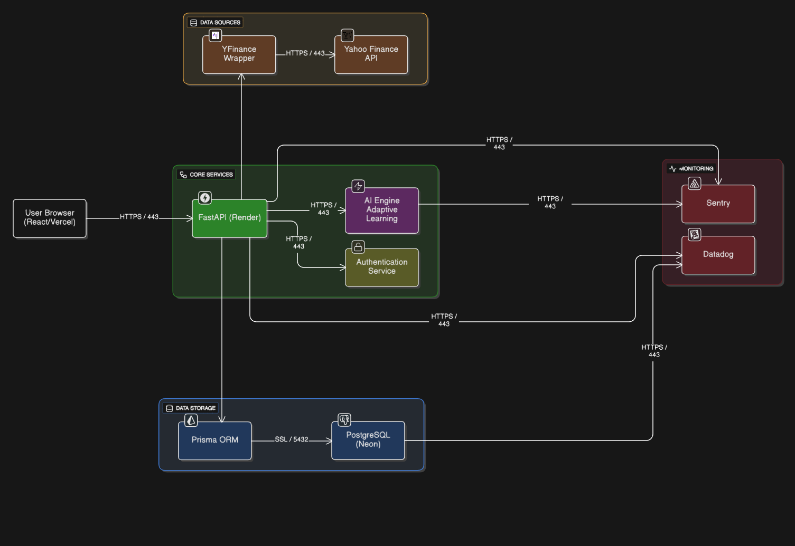

# Architecture Diagram

## Overview

Our platform uses a microservices architecture that separates the frontend, backend services, AI engine, external data sources, and monitoring infrastructure.
This design enables independent scaling and maintainability of each component.

## Core Components

### Frontend Layer
**User Browser (React)** - Hosted on Vercel
- Next.js web application with TypeScript and Mantine UI
- Handles portfolio management/analytics, learning pathways, and gamification
- Deployed on Vercel for automatic scaling and global CDN distribution

### Core Services (Hosted on Render)

**FastAPI Backend**
- Central API gateway orchestrating requests between frontend and backend services
- Handles business logic, validation, and communication with AI model, Authentication Service, and database
- Deployed on Render with automatic SSL and scaling

**AI Engine**
- Python-based service using LLMs to generate personalized learning pathways and analyze financial data
- Creates module suggestions based on user portfolio and quiz performance

**Authentication Service**
- Manages user registration, login, and sessions
- Validates tokens and protects API endpoints

### Data Sources

**YFinance Wrapper**
- Fetches real-time stock prices and market data from Yahoo Finance API
- Provides portfolio analytics and caches responses for performance

### Data Storage

**Prisma ORM + PostgreSQL (Neon)**
- Type-safe database client connecting to serverless PostgreSQL on Neon
- Stores user profiles, portfolios, learning progress, streaks, and badges
- Neon provides automatic scaling, backups, and branch-based development

### Monitoring

**Sentry & Datadog**
- Error tracking, performance monitoring, and system health dashboards
- Real-time alerts for critical issues

## Communication Flow

1. Users interact with React frontend on Vercel
2. Frontend sends HTTPS requests to FastAPI backend on Render
3. Backend routes requests to AI model, Authentication Service, or YFinance Wrapper
4. All data persists in Neon via Prisma ORM
5. Sentry and Datadog monitor errors and performance

## Key Design Decisions
- **Serverless Database**: Neon reduces operational overhead with automatic scaling
- **Centralized Backend**: Single API entry point simplifies client logic
- **Security**: All communication over HTTPS/SSL with environment-based secrets

---

**Diagram**: 
